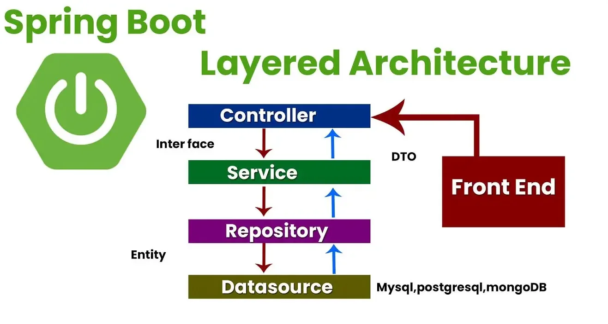
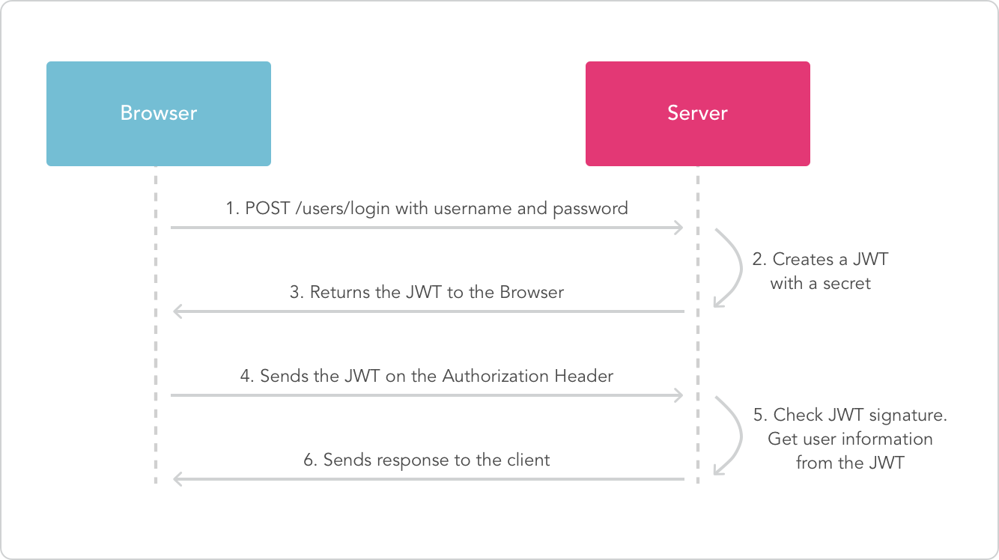
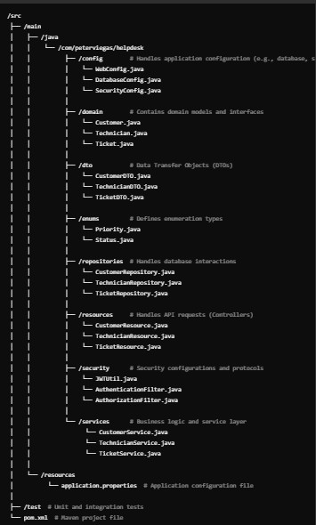
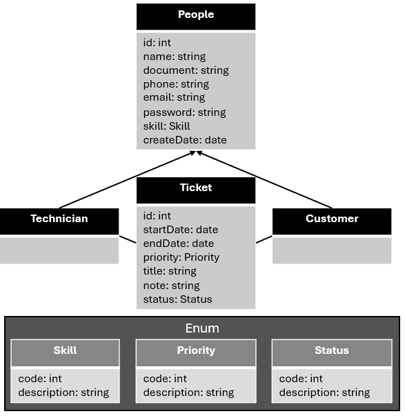
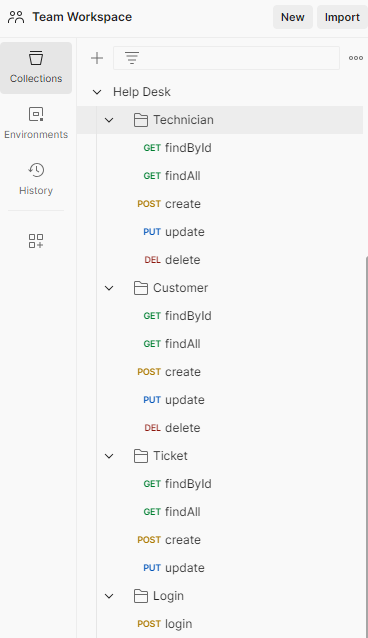

## Service Order Management System - Backend

Development of a REST API using Java with Spring Boot 2.3.12 and MySQL database. The project employs JPA with Hibernate for data validation, exception handling, and proper use of the HTTP protocol in the REST standard.

#### 📄 Table of Contents
- [About](#about)
- [Features](#features)
- [Installation](#installation)
- [Usage](#usage)
- [Test Coverage](#test-coverage)
- [Additional Information](#additional-information)
- [Contributing](#contributing)
- [License](#license)
- [Acknowledgments](#acknowledgments)

---

#### About
This is a web application implementing a CRUD (Create, Read, Update, and Delete) system for simple Service Order Management.

---

#### Features
- REST API developed using the **Spring Boot Framework 4.22.0**.
- Deployment of the REST API to the cloud via the Heroku platform. (Note: Heroku was used initially but is no longer free.)
- Implements **Object-Oriented Programming (OOP)** principles such as Polymorphism, Inheritance, and Encapsulation.
- Utilizes **Spring MVC** to structure and manage the HTTP requests and responses.
- Integrates **Spring Security** for authentication and authorization.
- Employs **Spring Data JPA** to manage data persistence and interact with the MySQL database.
- Uses **JWT (JSON Web Tokens)** for secure token-based authentication.
- Implements authentication and authorization.

Here is an example of the integration architecture:

---

#### 🚀 Installation
To set up the project locally, download the necessary tools:
- [Spring Tools Suite](https://spring.io/tools)
- [Java JDK 11 LTS](https://www.oracle.com/java/technologies/javase-downloads.html)
- [Heroku Account](https://www.heroku.com/) (Note: Heroku was used initially but is no longer free.)
- [Postman](https://www.postman.com/downloads/)

---

#### Usage
To run the project:
1. Clone the repository.
2. Import the project into your workspace using Spring Boot.
3. [Download the Postman collection here](postman/HelpDesk.postman_collection.json).
4. (Optional) Run the **Angular** frontend application, built to consume the REST API efficiently. Check it out at: https://github.com/peterviegas/helpdesk-front.

Project structure overview:

- **Config:** Handles application configuration, including database connections and security settings.
- **Domain:** Contains domain models and interfaces.
- **DTO:** Data Transfer Objects used for communication between the frontend and backend.
- **Enums:** Defines enumeration types and auxiliary tables.
- **Repositories:** Manages database interactions, processes requests from services, and returns data.
- **Resources:** Handles incoming requests and passes them to relevant services.
- **Security:** Contains security configurations and protocols.
- **Services:** Implements business logic, processes requests, and interacts with the database.

 
---

#### 🧪 Test Coverage
Tests were created to cover the core functionalities of the project. The parameters are passed via the **application.properties** file and include:

- Creating tables like Customer, Technician, and Ticket in the in-memory **H2** database for testing.
- Executing the following features:
  - Creating technicians.
  - Updating a technician.
  - Creating customers.
  - Updating a customer.
  - Creating **Tickets**.
  - Updating a Ticket.
  - Deleting a technician.
  - Deleting a customer.

Here is an example of the test coverage:

---

#### ℹ️ Additional Information

#### Customers
##### POST - CPF Validation
- Validates CPF according to Brazilian rules.
- Checks if the CPF already exists to avoid duplicating a customer.
- Validates email format and ensures it doesn't already exist in the database.

##### PUT - CPF Validation
- Checks for existing CPF during updates. If attempting to change to an already registered CPF, it returns an error.
- Validates email and ensures it isn't duplicated when updating a customer.

##### DELETE - Customer Deletion
- If a customer has any **Tickets**, deletion is not allowed.

---
#### Technicians

##### PUT - CPF Validation
- Validates the CPF according to Brazilian rules.
- Checks if the CPF already exists in the database to avoid duplicating a Technicians.
- Checks if the e-mail already exists in the database to avoid duplication a Technicians.

##### POST - Seller Update
- Receives the ID as a parameter and the body contains the information to be updated.
- If an invalid or already registered CPF is provided, the system informs that the CPF cannot be changed.
- If an invalid or already registered e-mail is provided, the system informs that the email cannot be changed.

##### DELETE - Seller Deletion
- Checks if the seller has any **Purchase Orders (PO)** linked to their ID. If they do, deletion is not allowed.

---

#### 📄 Ticket
##### POST - Additional Information:
- Uses an **enum** type for priority and status.
- Links seller and customer by their IDs through related tables.

##### PUT - Update PO
- Example of passing only the body for updating. The customer ID is included in the body instead of being a parameter in the URL.

---

#### 🤝 Contributing
I welcome contributions to this project! Here are a few ways you can get involved:

- **Reporting Bugs:** If you find any bugs, open an issue on the GitHub repository. Provide as much detail as possible to help us resolve the problem.
- **Suggesting Features:** Have new ideas or improvements? Open an issue to share your suggestions with us.
- **Submitting Pull Requests:** To contribute code, fork the repository, make your changes, and submit a pull request. We will review your contributions.

Refer to the Contribution Guidelines for more information.

---

#### 📜 License
This project is in the public domain. Feel free to use it as you wish.

---

#### 🙏 Acknowledgments
I would like to express my gratitude to **Vandir Cezar**, whose Udemy course provided me with invaluable knowledge. This project wouldn't have been possible without his comprehensive training and guidance.
